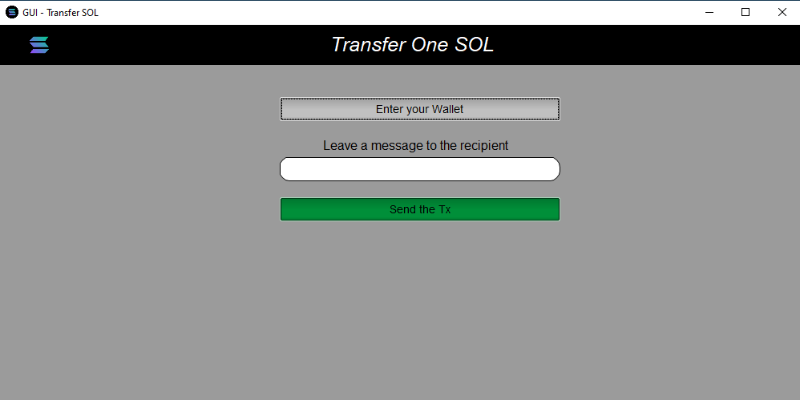
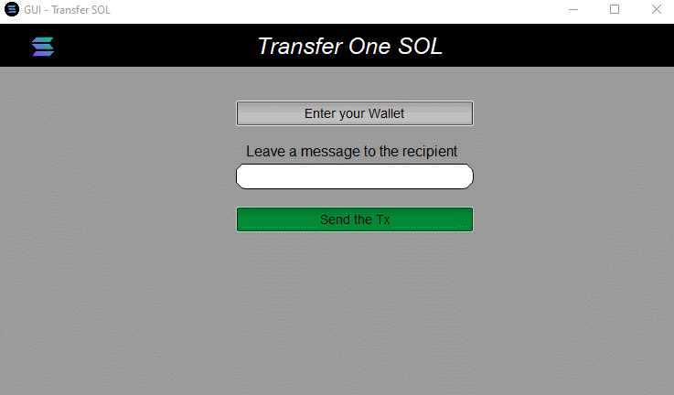
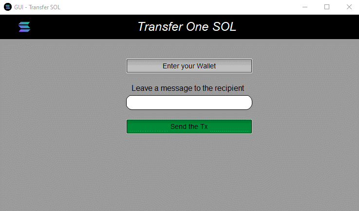
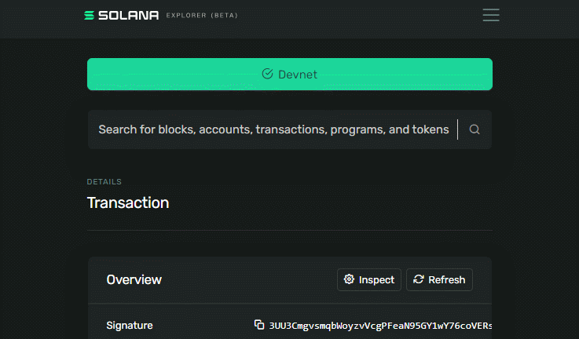

<div align="center">

  

  <h1>GUI Transfers one SOL 🌟

</h1>

  This program, developed with fltk.rs, aims to provide a user interface for native SOL transfers on the Solana blockchain.
</div>

---

<h3 align="center">📝App logic</h3>

The app allows the user to send native SOL transfers on the Solana blockchain.

The application has three buttons: "Enter your Wallet", "Leave a message to the recipient" and "Send the Tx". When the user clicks "Enter your Wallet", a file selection dialog opens allowing the user to select a JSON file containing their wallet information. The wallet information is stored using the store_wallet function. When the user clicks "Send the Tx", the program sends the SOL transfer using the extracted wallet information and the message provided by the user.

The code snippet also creates a top bar that contains the Solana logo and the title of the app.

<h3 align="center">🛠️Dependencies</h3>

Here are the dependencies used in this application:

| Dependencie   | Version  | Description                         |
| --------- | -------- | ----------------------------------- |
| fltk     | 1.4.1    | A cross-platform graphical user interface toolkit used for building the user interface of the application.                      |
| transfer_one_sol | no-entrypoint feature | A Rust crate that provides functions for sending a native SOL transfer on the Solana blockchain. The no-entrypoint feature is used to exclude the entrypoint function that is not needed in this application. |
| shellexpand | 2.1.0 | A crate used for expanding tilde and environment variables in paths. |
| anchor-client | 0.26.0 | A Rust crate that provides a client for the Anchor framework used to interact with Solana programs |
| serde_json | 1.0.94 | A Rust crate that provides serialization and deserialization of JSON data. |
| serde | 1.0.158 | A framework used to derive serialization and deserialization implementations for Rust data structures. |
| tokio | 1.26.0 | A runtime for writing reliable asynchronous applications in Rust. It is used in this application to spawn a task for sending the SOL transfer asynchronously. |

<h3 align="center">🚀Usage</h3>

To run the application, run the following command:

```bash
cargo run --release
```
This will launch the application and allow you to start sending SOL transfers on the Solana blockchain.

---



---
<div align="center">
<h4>First, choose your wallet</h4>



</div>

In the logic program the module exports a function called store_wallet that takes a Vec<u8> representing a new wallet and writes it to a JSON file named "src/wallet.json". The function first reads the existing wallet from the file, updates it with the new wallet, and then writes the updated wallet back to the file.

The Wallet struct is defined with a public wallet field of type Vec<u8>. This struct is derived from the Debug, Deserialize, and Serialize traits provided by the serde library. These traits enable serialization and deserialization of the Wallet struct to and from JSON format.

<div align="center">

<h4>Leave a message to the recipient</h4>



</div>

When using the Rust GUI developed with fltk.rs to send a native SOL transfer on the Solana blockchain, there is an option to leave a message for the transfer recipient. It's important to note that this message will be stored on the Solana blockchain as part of the transaction, which means it will be publicly accessible to anyone who has access to the blockchain.

It's important to be careful when writing messages on the Solana blockchain, and carefully consider what information you want to share publicly.

<div align="center">

<h4>Send SOL to the recipient</h4>



</div>

After sending SOL, the application will display a message with the corresponding transaction information. To verify that the transfer was successful, you can go to any Solana transaction explorer and check that the SOL has been correctly sent to the recipient. It is important to note that the transaction may take a few minutes to be confirmed and added to the Solana blockchain, so it is recommended to wait a bit before checking its status. Additionally, it is important to verify that the recipient's address is correct before making the transaction to avoid any errors or loss of funds.

<h3 align="center">License📜</h3>

This project is licensed under the Apache License, Version 2.0 (the "License"). You may not use this file except in compliance with the License. You may obtain a copy of the License at:

http://www.apache.org/licenses/LICENSE-2.0

Unless required by applicable law or agreed to in writing, software distributed under the License is distributed on an "AS IS" BASIS, WITHOUT WARRANTIES OR CONDITIONS OF ANY KIND, either express or implied. See the License for the specific language governing permissions and limitations under the License.

<div align="center">


</div>
